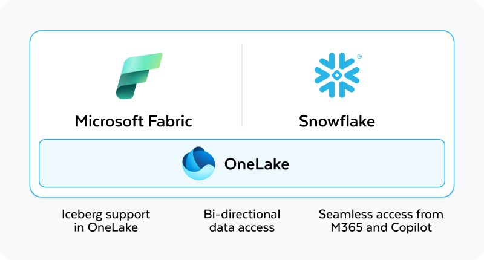

# Snowflake Managed Iceberg Table Integration with MS Fabric Lakehouse

## Overview

This project demonstrates two key integrations between Snowflake Managed Iceberg tables and Microsoft Fabric Lakehouse:

1. **Access Existing Snowflake Managed Iceberg Tables in MS Fabric Lakehouse**
2. **Integrate MS Fabric OneLake as Storage for New Snowflake Managed Iceberg Tables**

With the rising demand for data interoperability, Iceberg, an open table format, eliminates data silos by enabling seamless integration with cloud data platforms.

Snowflake and Microsoft Fabric have partnered in early 2024 to simplify data access between these platforms.

---

## Key Implementation Guidelines

### 1. Snowflake Managed Iceberg Table in Azure Storage

- **Storage Account Requirement:** Ensure the Azure Storage Account has **Hierarchical Namespace** enabled.
  - This makes it file storage (SMB compliant) rather than blob storage.
- **Table Shortcuts:** Use **Tables -> Shortcuts** in MS Fabric Lakehouse, not **Files -> Shortcuts**, to avoid creation issues.
- **Delta Log Creation:** MS Fabric automatically creates a virtualized Delta log for the Iceberg table (check the table’s **View Files** option).

### 2. Using OneLake Storage as External Volume

- **Same Region Requirement:** Ensure that the **Fabric Capacity** and **Snowflake Region** are identical.
  - Example: If Snowflake is in **Azure East US**, the Fabric Capacity should also be in **East US**.
  - Need to provide user or service principal Storage Blob Delegator role on which the iceberg table is present.

### 3. MS Fabric Service Principal Configuration

- **Fabric Admin Settings:**
  - Enable **Service Principal Use Fabric API** from the MS Fabric Admin Portal.
- **Service Principal Creation:**
  - Provide consent obtained from Snowflake.
  - Assign **Workspace Contributor** role to the Service Principal where the Lakehouse resides.
- **External Volume URL:**
  - Here we are creating below:
 --> Snowflake Managed Iceberg table having external volume in MS FABRIC ONE LAKE.
 --> MS fabric can access this ICEBERG table using Files in NON-SCHEMA ENABLED LAKEHOUSE But you cannot have it in DATAWARHOUSE ( as it SCHEMA enabled).
  - Use the **Files -> Properties -> URL** (not the `abfss://` URL) to create the external volume in Lakehouse.

---

## Conclusion

By following these steps, you can efficiently integrate Snowflake Managed Iceberg tables with MS Fabric Lakehouse, leveraging the best of both platforms without data silos.
